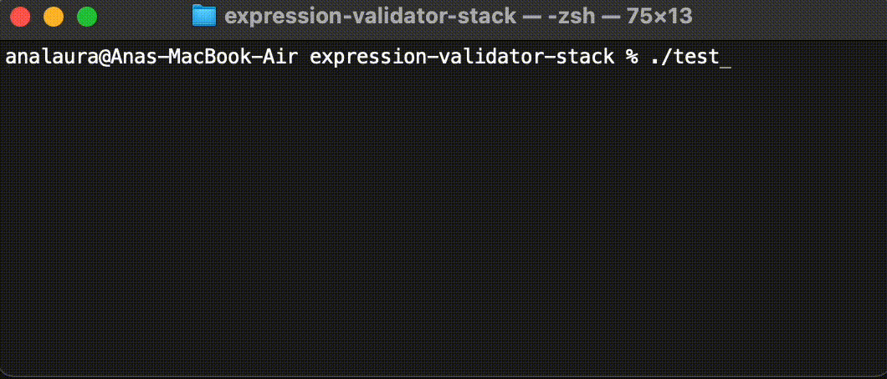
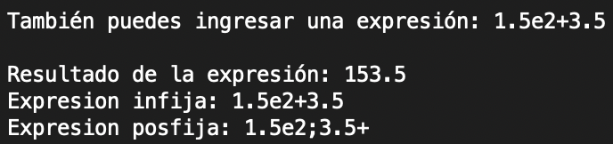
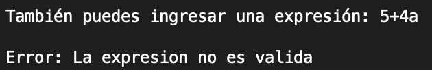
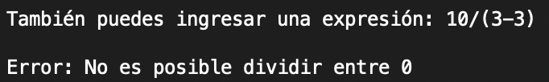
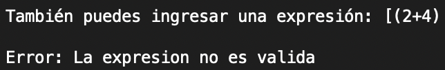

# Expression Validator with Stacks

This is an academic C++ project that validates and evaluates mathematical expressions using stack-based logic. The program reads an infix expression from the user, checks for syntax correctness (especially balanced parentheses and valid characters), converts it into postfix notation, and finally evaluates it.

<table>
  <tr>
    <td></td>
    <td></td> 
  </tr>
  <tr>
    <td></td>
    <td></td> 
  </tr>
  <tr>
    <td></td>
    <td></td> 
  </tr>
</table>

## Features

- Supports infix and postfix notation.
- Handles parentheses `()`, `[]`, `{}` for grouping.
- Detects and rejects invalid expressions (unbalanced brackets, invalid characters, malformed numbers, division by zero, etc).
- Converts infix expressions to postfix (Reverse Polish Notation).
- Evaluates numeric expressions, including:
  - Integer and decimal numbers
  - Scientific notation (e.g. `1.5e2`, `3.2e-1`)
  - Operators: `+`, `-`, `*`, `/`, `^`

## Technologies

- C++17
- Custom stack implementation
- Object-Oriented Programming

## Learning Objectives

- Practice stacks and expression parsing.
- Implement infix to postfix conversion algorithm.
- Evaluate postfix expressions using stacks.
- Detect edge cases and invalid syntax in arithmetic expressions.

## How to Compile and Run

```bash
clang++ -std=c++17 -Wall -o test main.cpp Expresion/Expresion.cpp 
./test
```
For Windows, you can run the executable `Expresion.exe`.

## Project Structure

```
expression-validator-stack/
├── Expresion/         # Expression validation and evaluation logic
│   └── Expresion.cpp
├── Pila/              # Stack implementation
│   └── Pila.cpp
├── main.cpp           # User interface and driver
└── README.md
```

## Authors

- Ana Laura Chenoweth Galaz

## License

This project is intended for educational purposes and is shared under the MIT License.

